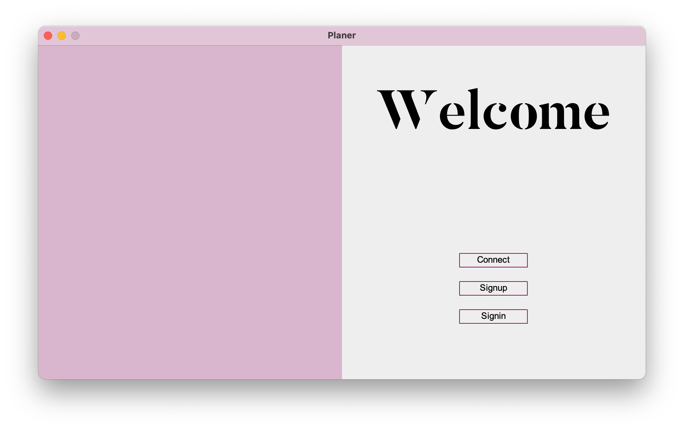

# Wedding Planner
---
We are developing an enterprise-level Java program aimed at assisting wedding planners with their managerial tasks. Our development platform of choice will be Netbeans, and we will utilize ANT for our project management needs. It is important to note that this is currently a demonstration version, and further updates will be necessary to ensure full functionality. Our software automates a local database that has been built using MYSQL.

## Requirements
- [Connector/J 8.0.33](https://dev.mysql.com/downloads/connector/j/) (For Developemnt) 
- Java 

## Run
---
To run the project from the command line, go to the dist folder and
type the following:

```
java -jar "dist/wedding_planner.jar"
``` 

```
ant -f /Users/alpha/Documents/Github/wedding-planner -Dnb.internal.action.name=run run
```

To distribute this project, zip up the dist folder (including the lib folder)
and distribute the ZIP file.


## Rules
--- 
* Do not merge any pull request with out GD
* Always create your own branch before working
* Alwasy create a issue of your work before wokting 
* Do not update any thing with out mentioning 
* Be availabe for Gmeet daily from 9:30 to 11:30 pm

## Application
**Tap Image To See Demo**

[](https://youtu.be/lNSwRlMQVXA)
